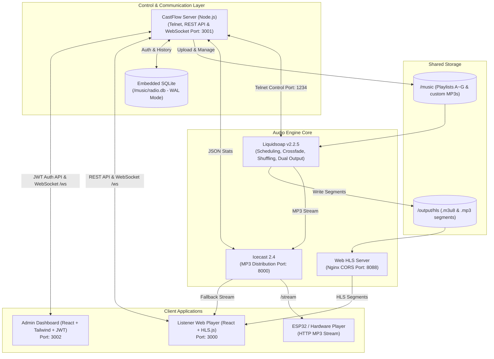

# CastFlow 📻

**English** | [繁體中文](README.zh-TW.md)

> **CastFlow** is a modern, cloud-native automated audio broadcasting and stream scheduling platform with dual Web UIs.  
> Designed for indie artists, radio station hosts, developers, and homelab enthusiasts, CastFlow delivers dual-stream outputs for both IoT hardware (ESP32, VLC) and modern web browsers (Web HLS). It features intuitive visual scheduling, auto-shuffling, hourly interstitials, and broadcast-grade smooth crossfades.

---

## Architecture



---

## Key Features

* ☁️ **Cloud-Native Microservices & Dual Deployment**:
  * **Docker Compose**: One-click startup in seconds for standalone servers or homelab.
  * **Kubernetes / K3s**: Production-ready YAML manifests included (Namespace isolation, PVC shared storage, dynamic ConfigMap mounting, and health probes).
* 📻 **Dual-Track Stream Output**:
  * **Icecast MP3 Stream (`/stream`)**: Direct streaming for ESP32/Arduino IoT devices and legacy players (VLC, foobar2000).
  * **Web HLS Stream (`/hls`)**: Powered by HLS.js for low-latency, stutter-free playback across all modern desktop and mobile browsers.
* ⚡ **Real-Time WebSocket Sync (`/ws`)**: Sub-second push notifications for track changes, playback progress, and listener count without polling.
* 🗄️ **Embedded SQLite Database**: Lightweight SQLite database with WAL (Write-Ahead Logging) enabled at `/music/radio.db`. Stores playback history, visual schedule rules, and administrator authentication.
* 🔐 **Security & Access Control**:
  * Auto-generates a secure random administrator password upon initial boot (e.g., `cf_xxxxxx`).
  * Public endpoints (streams, status, history, album covers) are freely accessible.
  * Administrative operations (track skipping, folder reload, uploads, schedule configuration, full backup/restore) are strictly protected by JWT signatures.
* 🎛️ **Flexible AutoDJ Scheduling Engine**:
  * Supports continuous daily rotation with weighted ratios and specific time windows (including cross-midnight support).
  * Supports hourly / recurring interstitials (e.g., chime or jingle at :00 or :30 past every hour).
  * Features smooth crossfades and high-priority dynamic queue injection via Telnet.
* 🖥️ **Modern Dual Web Applications**:
  * **Listener Player**: Rotating vinyl turntable animation, dynamic album art, upcoming track queue, and keyboard shortcuts (Space to Play/Pause, F for Fullscreen).
  * **Admin Console**: Drag-and-drop playlist management (MP3/ZIP/folders), live audio preview monitoring, visual scheduling manager, real-time log inspector, and comprehensive backup/restore.

---

## Default Playlists & Scheduling Logic

Playlists A through G are preconfigured with intuitive roles:

| Directory | Role | Default Behavior |
| :--- | :--- | :--- |
| **`/music/A`** | Daily Core Rotation | **75% weight** during regular hours; 3:1 rotation ratio with Playlist B |
| **`/music/B`** | Daily Secondary Interstitial | **25% weight** during regular hours; 1 song every 3 songs from A |
| **`/music/C`** | Hourly Dedicated Interstitial | Plays 1 song at the beginning of each hour after current song finishes (`wait_track_end`) |
| **`/music/D`** | 21:30 Timed Interstitial | Smooth crossfade at 21:30 |
| **`/music/E`** | 21:40 Timed Interstitial | Smooth crossfade at 21:40 |
| **`/music/F`** | 21:50 Timed Interstitial | Smooth crossfade at 21:50 |
| **`/music/G`** | Late Night Relaxing Stream | 22:00 ~ 23:00 rotated with Playlist A at **1:1 ratio** |

* General rule: Playlists load in randomized/shuffle mode. All track transitions are protected by broadcast-grade smooth crossfading.

---

## Quick Start (Docker Compose)

### 1. Clone the repository & Start Services
```bash
git clone https://github.com/fly530/CastFlow.git
cd CastFlow
docker compose up -d
```

### 2. Retrieve Initial Admin Password
On first startup, a secure administrator password is automatically created:
```bash
docker logs castflow-server | grep -E "Password|admin"
```

### 3. Service Access Endpoints
* **Web Player (Listener UI)**: [http://localhost:3000](http://localhost:3000)
* **Admin Dashboard (Console)**: [http://localhost:3002](http://localhost:3002)
* **Backend API & WebSocket Server**: [http://localhost:3001](http://localhost:3001) / `ws://localhost:3001/ws`
* **Icecast MP3 Stream**: `http://localhost:8000/stream` (ESP32 / VLC)
* **HLS Web Stream**: `http://localhost:8088/live.m3u8`
* **Icecast Admin Dashboard**: [http://localhost:8000](http://localhost:8000) (User: `admin` / Pass: `hackme`)

---

## Kubernetes / K3s Deployment

Production-grade Kubernetes manifests are provided in the `k8s/` directory:

```bash
# 1. Validate manifest syntax
kubectl apply --dry-run=client -f k8s/

# 2. Deploy to Kubernetes cluster (default namespace: castflow)
kubectl apply -f k8s/
```

Included manifests:
* `00-namespace.yaml`: Creates the dedicated `castflow` namespace.
* `10-configmap.yaml`: Mounts dynamic Liquidsoap scripts.
* `20-pvc.yaml`: PersistentVolumeClaims for audio files and HLS segments.
* `30-icecast.yaml` & `40-liquidsoap.yaml`: Audio streaming and scheduling core deployments.
* `45-web-hls.yaml`: Nginx HLS CORS web server.
* `50-service.yaml`: ClusterIP service routes.
* `60-server.yaml`, `70-player.yaml`, `80-admin.yaml`: Backend server and frontend web microservices.

---

## REST API & WebSocket Summary

| Method / Protocol | Endpoint | Authentication | Description |
| :--- | :--- | :--- | :--- |
| `WS` | `/ws` | Public | Real-time push notifications (track changes, progress, listener counts) |
| `GET` | `/health` | Public | Server health status & Telnet connection probe |
| `GET` | `/api/status` | Public | Unified broadcast status (now playing, progress, listeners, stats) |
| `GET` | `/api/history` | Public | Recent playback history (SQLite) |
| `GET` | `/api/current/cover`| Public | Album artwork image for currently playing track |
| `POST`| `/api/auth/login` | Public | Admin login endpoint returning JWT token |
| `GET` | `/api/auth/me` | JWT Required | Returns current authenticated administrator info |
| `POST`| `/api/auth/change-password` | JWT Required | Change administrator password |
| `POST`| `/api/control/skip` | JWT Required | Skip currently playing track |
| `POST`| `/api/control/reload` | JWT Required | Force reload of all playlist audio folders |
| `POST`| `/api/control/telnet` | JWT Required | Execute raw Liquidsoap Telnet commands |
| `GET` | `/api/playlists` | Public | List all playlists and track counts |
| `GET` | `/api/playlists/:id/tracks` | Public | List tracks and ID3 metadata for a playlist |
| `POST`| `/api/playlists/:id/upload` | JWT Required | Upload MP3/ZIP/folders to a playlist |
| `DELETE`| `/api/playlists/:id/tracks/:filename` | JWT Required | Delete a track from a playlist |
| `GET` | `/api/schedules` | Public | Retrieve all visual scheduling rules |
| `POST`| `/api/schedules` | JWT Required | Create a new scheduling rule (continuous or recurring) |
| `PUT` | `/api/schedules/:id` | JWT Required | Update an existing scheduling rule |
| `DELETE`| `/api/schedules/:id` | JWT Required | Delete a scheduling rule |
| `GET` | `/api/backup/export` | JWT Required | Export configuration backup (JSON) |
| `GET` | `/api/backup/export-full` | JWT Required | Export full station backup (ZIP with all MP3s) |
| `POST`| `/api/backup/restore` | JWT Required | Restore station data from backup |

---

## License & Acknowledgements

* Core application code is licensed under the [MIT License](LICENSE).
* Upstream open source dependencies (Liquidsoap, Icecast, AzuraCast, hls.js, music-metadata) and architectural boundaries are documented in [ACKNOWLEDGEMENTS.md](ACKNOWLEDGEMENTS.md).
