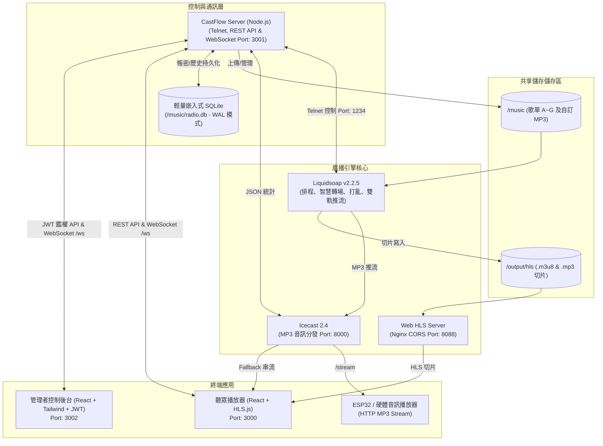

# CastFlow 📻

[English](README.md) | **繁體中文**

> **CastFlow** 是一個現代化、雲原生（Cloud-Native）、且具備雙前端 Web 介面的自動化廣播電台與排程串流平台。  
> 專為獨立音樂人、電台站長、開發者與自架愛好者（Homelab）打造，支援硬體播放器（ESP32 / VLC）與現代瀏覽器（Web HLS）雙軌音訊串流輸出，具備直覺的視覺化排程、打亂、整點插播與廣播級智慧淡入淡出（Crossfade）。

---

## 系統架構 (Architecture)



---

## 核心特色

* ☁️ **雲原生微服務與雙軌部署**：
  * **Docker Compose**：單機一鍵秒級啟動，適合個人自架或邊緣伺服器。
  * **Kubernetes / K3s**：開箱即用的標準 YAML 清單（包含 Namespace 隔離、PVC 共享儲存、ConfigMap 掛載與健康探針）。
* 📻 **雙軌串流輸出**：
  * **Icecast MP3 串流 (`/stream`)**：支援 ESP32 / Arduino 等物聯網硬體播放器、傳統播放器（VLC、foobar2000）。
  * **Web HLS 串流 (`/hls`)**：採用 HLS.js，為現代 Web 瀏覽器提供低延遲且穩定的切片播放。
* ⚡ **WebSocket 毫秒級即時同步 (`/ws`)**：曲目切換、當前播放進度、在線聽眾數毫秒級主動推送至前台與管理面板，無須瀏覽器高頻輪詢。
* 🗄️ **輕量內嵌 SQLite 資料庫**：免除外部資料庫龐大負擔，在 `/music/radio.db` 啟用 WAL 模式，自動記錄曲目歷史（Play History）、自訂排程規則與管理員鑑權資訊。
* 🔐 **安全防護與權限隔離**：
  * 首次開機於容器啟動日誌中自動產生安全隨機管理密碼（格式如 `cf_xxxxxx`）。
  * 公開聽眾端點（串流、即時狀態、播放歷史、專輯封面）免登入即可存取。
  * 管理操作（切歌、歌單重載、MP3 上傳、排程配置、全站備份還原）全面受 JWT 簽名防護。
* 🎛️ **強大靈活的 AutoDJ 排程引擎**：
  * 支援全天連續輪播（可設定時段或全天、權重比例輪播）。
  * 支援整點/定分固定插播（例如每小時 00 分或 30 分插播專屬歌單，跨午夜時段支援）。
  * 支援平滑淡入淡出（Crossfade）與動態佇列（Dynamic Queue）優先插播。
* 🖥️ **精美現代化雙 Web 介面**：
  * **聽眾播放器**：黑膠唱片旋轉擬真動畫、即時專輯封面、即將播放佇列、鍵盤快捷鍵操控（空白鍵暫停、F 全螢幕）。
  * **管理控制台**：直覺歌單拖曳上傳、即時音訊監聽切換、視覺化排程增刪改查、即時日誌與全站資料備份/還原。

---

## 排程規則配置 (Scheduling Rules)

系統預設將曲目分為 A ~ G 歌單資料夾，並可於管理後台自由建立自訂排程：

| 歌單目錄 | 預設角色任務 | 排程邏輯說明 |
| :--- | :--- | :--- |
| **`/music/A`** | 日常主力歌單 | 日常時段佔 **75% 權重**，與 B 歌單 3:1 比例輪替 |
| **`/music/B`** | 日常插播歌單 | 日常時段佔 **25% 權重**，每 3 首 A 插播 1 首 B |
| **`/music/C`** | 整點專屬插播 | 每小時初等待當前曲目播完（`wait_track_end`）插播 1 首 C |
| **`/music/D`** | 21:30 定時插播 | 21:30 漸弱切換播放單曲 |
| **`/music/E`** | 21:40 定時插播 | 21:40 漸弱切換播放單曲 |
| **`/music/F`** | 21:50 定時插播 | 21:50 漸弱切換播放單曲 |
| **`/music/G`** | 夜間時段輪播 | 22:00 ~ 23:00 與 A 歌單以 **1:1 權重輪替** |

* 通用規則：歌單曲目預設以隨機打亂（Shuffle）模式載入，切歌時皆經過平滑淡入淡出轉場保護。

---

## 本地快速啟動 (Docker Compose)

### 1. 複製專案並啟動所有微服務
```bash
git clone https://github.com/fly530/CastFlow.git
cd CastFlow
docker compose up -d
```

### 2. 獲取初次管理員隨機密碼
在伺服器首次開機時，系統會自動在 SQLite 建立安全管理員密碼：
```bash
docker logs castflow-server | grep -E "Password|admin"
```

### 3. 服務訪問端點
* **聽眾播放器 (Web Player)**：[http://localhost:3000](http://localhost:3000)
* **管理控制台 (Admin Console)**：[http://localhost:3002](http://localhost:3002)
* **後端 API / WebSocket 伺服器**：[http://localhost:3001](http://localhost:3001) / `ws://localhost:3001/ws`
* **Icecast MP3 串流**：`http://localhost:8000/stream` (ESP32 / VLC 播放)
* **HLS Web 串流**：`http://localhost:8088/live.m3u8`
* **Icecast 儀表板**：[http://localhost:8000](http://localhost:8000) (帳號: `admin` / 密碼: `hackme`)

---

## K3s / Kubernetes 叢集部署

本專案提供符合生產級別的 K8s 部署資源定義清單：

```bash
# 1. 預先驗證部署清單語法
kubectl apply --dry-run=client -f k8s/

# 2. 部署至 K8s 叢集 (預設命名空間: castflow)
kubectl apply -f k8s/
```

部署清單包含：
* `00-namespace.yaml`: 隔離至獨立 `castflow` Namespace。
* `10-configmap.yaml`: 動態掛載 Liquidsoap 排程腳本。
* `20-pvc.yaml`: 音訊檔案與 HLS 切片之 PersistentVolumeClaims。
* `30-icecast.yaml` & `40-liquidsoap.yaml`: 核心音訊推流與排程引擎 Deployment。
* `45-web-hls.yaml`: Nginx HLS CORS 服務。
* `50-service.yaml`: ClusterIP 內部服務轉發路由。
* `60-server.yaml`, `70-player.yaml`, `80-admin.yaml`: 後端 API 與雙 Web 前端微服務。

---

## 後端 REST API 與 WebSocket 摘要

| Method / Protocol | Endpoint | 鑑權要求 | 說明 |
| :--- | :--- | :--- | :--- |
| `WS` | `/ws` | 公開 | 即時廣播狀態主動推播（曲目變更、進度、聽眾更新） |
| `GET` | `/health` | 公開 | 伺服器健康狀態與 Telnet 連線狀態 |
| `GET` | `/api/status` | 公開 | 整合性廣播狀態（當前曲目、進度、聽眾數、歌單統計） |
| `GET` | `/api/history` | 公開 | 查詢最近播放曲目歷史紀錄 (SQLite) |
| `GET` | `/api/current/cover`| 公開 | 取得當前播放曲目的專輯封面圖片 |
| `POST`| `/api/auth/login` | 公開 | 管理員帳號密碼登入並取得 JWT Token |
| `GET` | `/api/auth/me` | JWT 驗證 | 取得當前登入管理員身分資訊 |
| `POST`| `/api/auth/change-password` | JWT 驗證 | 修改當前管理員密碼 |
| `POST`| `/api/control/skip` | JWT 驗證 | 遠端觸發跳至下一首 |
| `POST`| `/api/control/reload` | JWT 驗證 | 強制熱重載所有歌單資料夾 |
| `POST`| `/api/control/telnet` | JWT 驗證 | 發送原生 Liquidsoap Telnet 指令 |
| `GET` | `/api/playlists` | 公開 | 獲取歌單摘要與曲目計數 |
| `GET` | `/api/playlists/:id/tracks` | 公開 | 取得指定歌單曲目與 ID3 Metadata |
| `POST`| `/api/playlists/:id/upload` | JWT 驗證 | 上傳 MP3 檔案/ZIP/資料夾至指定歌單 |
| `DELETE`| `/api/playlists/:id/tracks/:filename` | JWT 驗證 | 刪除指定歌單中的曲目 |
| `GET` | `/api/schedules` | 公開 | 獲取當前所有智慧排程規則清單 |
| `POST`| `/api/schedules` | JWT 驗證 | 新增智慧排程規則（連續輪播/整點定分插播） |
| `PUT` | `/api/schedules/:id` | JWT 驗證 | 更新指定排程規則 |
| `DELETE`| `/api/schedules/:id` | JWT 驗證 | 刪除指定排程規則 |
| `GET` | `/api/backup/export` | JWT 驗證 | 匯出歌單與排程設定備份檔 (JSON) |
| `GET` | `/api/backup/export-full` | JWT 驗證 | 匯出全站備份檔 (ZIP，含所有 MP3 音訊檔) |
| `POST`| `/api/backup/restore` | JWT 驗證 | 匯入還原備份資料 |

---

## 開源協議與鳴謝

* 本專案自研程式碼依據 [MIT License](LICENSE) 授權開源。
* 上游開源依賴（Liquidsoap、Icecast、AzuraCast、hls.js、music-metadata）之鳴謝與隔離架構說明請參閱 [ACKNOWLEDGEMENTS.zh-TW.md](ACKNOWLEDGEMENTS.zh-TW.md)。
