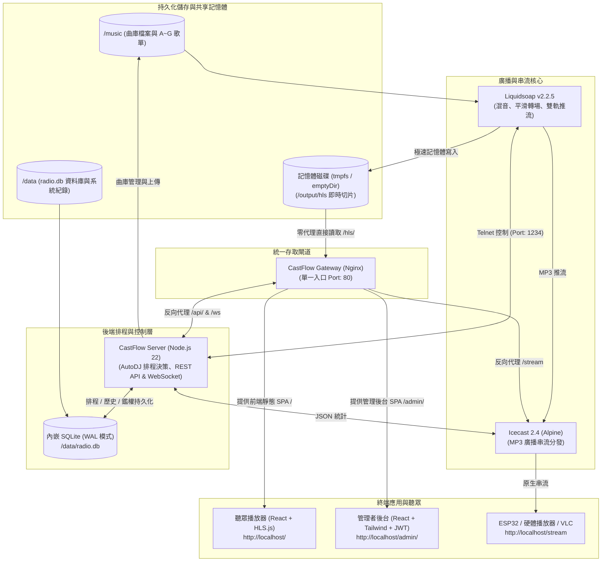

# CastFlow 📻

[English](README.md) | **繁體中文**

> **CastFlow** 是一個現代化、雲原生（Cloud-Native）、且具備雙前端 Web 介面的自動化廣播電台與排程串流平台。  
> 專為獨立音樂人、電台站長、開發者與自架愛好者（Homelab）打造，支援硬體播放器（ESP32 / VLC）與現代瀏覽器（Web HLS）雙軌音訊串流輸出，具備直覺的視覺化排程、打亂、整點插播與廣播級智慧淡入淡出（Crossfade）。

---

## 系統架構 (Architecture)



---

## 核心特色

* ☁️ **雲原生微服務與雙軌部署**：
  * **Docker Compose**：單機一鍵秒級啟動，適合個人自架或邊緣伺服器。
  * **Kubernetes / K3s**：開箱即用的標準 YAML 清單（包含 Namespace 隔離、PVC 共享儲存、ConfigMap 掛載與健康探針）。
* 📻 **雙軌串流輸出**：
  * **Icecast MP3 串流 (`/stream`)**：支援 ESP32 / Arduino 等物聯網硬體播放器、傳統播放器（VLC、foobar2000）。
  * **Web HLS 串流 (`/hls`)**：採用 HLS.js，為現代 Web 瀏覽器提供低延遲且穩定的切片播放。
* ⚡ **WebSocket 毫秒級即時同步 (`/ws`)**：曲目切換、當前播放進度、在線聽眾數毫秒級主動推送至前台與管理面板，無須瀏覽器高頻輪詢。
* 🗄️ **輕量內嵌 SQLite 資料庫**：免除外部資料庫龐大負擔，在 `/data/radio.db` 啟用 WAL 模式，自動記錄曲目歷史（Play History）、自訂排程規則與管理員鑑權資訊（與音樂目錄分離，確保備份還原不混淆）。
* 🔐 **安全防護與權限隔離**：
  * 首次開機於容器啟動日誌中自動產生安全隨機管理密碼（格式如 `cf_xxxxxx`）。
  * 公開聽眾端點（串流、即時狀態、播放歷史、專輯封面）免登入即可存取。
  * 管理操作（切歌、歌單重載、MP3 上傳、排程配置、全站備份還原）全面受 JWT 簽名防護。
* 🎛️ **強大靈活的 AutoDJ 排程引擎**：
  * 支援全天連續輪播（可設定時段或全天、權重比例輪播）。
  * 支援整點/定分固定插播（例如每小時 00 分或 30 分插播專屬歌單，跨午夜時段支援）。
  * 支援平滑淡入淡出（Crossfade）與動態佇列（Dynamic Queue）優先插播。
* 🖥️ **精美現代化雙 Web 介面**：
  * **聽眾播放器**：黑膠唱片旋轉擬真動畫、即時專輯封面、即將播放佇列、鍵盤快捷鍵操控（空白鍵暫停、F 全螢幕）。
  * **管理控制台**：直覺歌單拖曳上傳、即時音訊監聽切換、視覺化排程增刪改查、即時日誌與全站資料備份/還原。

---

## 排程規則配置 (Scheduling Rules)

系統預設將曲目分為 A ~ G 歌單資料夾，並可於管理後台自由建立自訂排程：

| 歌單目錄 | 預設角色任務 | 排程邏輯說明 |
| :--- | :--- | :--- |
| **`/music/A`** | 日常主力歌單 | 日常時段佔 **75% 權重**，與 B 歌單 3:1 比例輪替 |
| **`/music/B`** | 日常插播歌單 | 日常時段佔 **25% 權重**，每 3 首 A 插播 1 首 B |
| **`/music/C`** | 整點專屬插播 | 每小時初等待當前曲目播完（`wait_track_end`）插播 1 首 C |
| **`/music/D`** | 21:30 定時插播 | 21:30 漸弱切換播放單曲 |
| **`/music/E`** | 21:40 定時插播 | 21:40 漸弱切換播放單曲 |
| **`/music/F`** | 21:50 定時插播 | 21:50 漸弱切換播放單曲 |
| **`/music/G`** | 夜間時段輪播 | 22:00 ~ 23:00 與 A 歌單以 **1:1 權重輪替** |

* 通用規則：歌單曲目預設以隨機打亂（Shuffle）模式載入，切歌時皆經過平滑淡入淡出轉場保護。

---

## 本地快速啟動 (Docker Compose)

### 1. 複製專案
```bash
git clone https://github.com/fly530/CastFlow.git
cd CastFlow
```

### 2. 建立 .env（★ 必要，缺少時 compose 會直接拒絕啟動）

金鑰現場生成，不必手動想密碼：

```bash
cat > .env <<EOF
JWT_SECRET=$(openssl rand -hex 32)
ICECAST_SOURCE_PASSWORD=$(openssl rand -hex 16)
ICECAST_ADMIN_PASSWORD=$(openssl rand -hex 16)
EOF
```

> 不要直接 `cp .env.example .env` 就上 —— 那裡面是佔位字串，伺服器會辨識出
> 來並拒絕啟動。範本的用途是說明有哪些變數，不是拿來直接用的。
>
> `JWT_SECRET` 是管理員憑證的簽章金鑰，用可預測的值等於沒有驗證。
> `ICECAST_SOURCE_PASSWORD` 同時是 Liquidsoap 推流用的密碼，兩邊共用同一把。

### 3. 啟動所有微服務
```bash
docker compose up -d
```

### 4. 獲取初次管理員隨機密碼
在伺服器首次開機時，系統會自動在 SQLite 建立安全管理員密碼：
```bash
docker logs castflow-server | grep -E "Password|admin"
```

### 5. 服務訪問端點 (統一由 Gateway Port 80 守門)
* **聽眾播放器 (Web Player)**：[http://localhost](http://localhost) (標準 Port 80)
* **管理控制台 (Admin Console)**：[http://localhost/admin/](http://localhost/admin/)
* **後端 API / WebSocket 伺服器**：`http://localhost/api` / `ws://localhost/ws` (內部容器轉發，外界免開 3001)
* **Icecast MP3 直播串流**：`http://localhost/stream` (ESP32 / VLC / 傳統硬體播放)
* **Web HLS 切片串流**：`http://localhost/hls/live.m3u8`

---

## K3s / Kubernetes 叢集部署

本專案提供符合生產級別的 K8s 部署資源定義清單：

```bash
# 1. 建立 Namespace
kubectl apply -f k8s/00-namespace.yaml

# 2. 產生 Secret（★ 必要步驟，不做的話 server 會拒絕啟動）
#    金鑰用指令現場生成，不寫進檔案、不進版控。
kubectl -n castflow create secret generic castflow-secrets \
  --from-literal=jwt-secret="$(openssl rand -hex 32)" \
  --from-literal=icecast-source-password="$(openssl rand -hex 16)" \
  --from-literal=icecast-admin-password="$(openssl rand -hex 16)"

# 3. 預先驗證部署清單語法
kubectl apply --dry-run=client -f k8s/

# 4. 部署至 K8s 叢集 (預設命名空間: castflow)
kubectl apply -f k8s/

# 5. 取得首次登入的管理員隨機密碼
kubectl -n castflow logs deploy/server | grep -A4 "CastFlow Security"
```

> **關於對外存取**：`70-gateway.yaml` 的 Service 預設是 `type: LoadBalancer`。
> 若叢集沒有 LoadBalancer controller（例如以 `--disable servicelb` 安裝的 K3s，
> 或裸機自建環境），EXTERNAL-IP 會永遠停在 `<pending>`，外部連不進來。
> 這種環境請改成 `type: NodePort`，再由既有的反向代理指向該埠。

> **關於更新映像**：清單使用 `:latest` + `imagePullPolicy: IfNotPresent`。
> 重新建置同名 tag 後 Deployment **不會**自動察覺，需手動觸發：
> `kubectl -n castflow rollout restart deploy/server deploy/gateway`
> 正式環境建議改用帶版號的 tag。

部署清單包含：
* `00-namespace.yaml`: 隔離至獨立 `castflow` Namespace。
* `10-configmap.yaml`: 動態掛載 Liquidsoap 排程腳本（內容需與 `liquidsoap/radio.liq` 完全一致，CI 有檢查）。
* `15-secret.yaml.example`: Secret 範本與生成指令。**刻意不是 `.yaml`**，以免帶著佔位金鑰被 `kubectl apply -f k8s/` 套進叢集。
* `20-pvc.yaml`: 音訊檔案、資料庫與備份檔之 PersistentVolumeClaims (ReadWriteOnce 適配 local-path)。
* `30-icecast.yaml`: 核心音訊推流伺服器 Icecast Deployment。
* `50-service.yaml`: 內部服務轉發路由 (Icecast 與 Liquidsoap ClusterIP)。
* `60-server.yaml`: 後端 Node.js API 伺服器 Deployment 與 Service。
* `70-gateway.yaml`: 單一整合 Gateway 與 Liquidsoap (同 Pod 共享記憶體 tmpfs 零磁碟耗損 + 對外 LoadBalancer Service)。
* `90-networkpolicy.yaml`: 限制 Liquidsoap Telnet (1234) 僅接受 server Pod 連入（需 CNI 支援 NetworkPolicy 才生效）。

### 排程的執行依賴

排程判斷全部在後端 Node.js 的 AutoDJ 排程器（每 5 秒一次），透過 Telnet 推送至
Liquidsoap 的 `dynamic_queue`；`radio.liq` 本身只負責播放佇列與轉場，不含任何時段邏輯。
這確保後台改排程立即生效、不需重載 Liquidsoap。

代價是 **`server` Pod 停止時排程會失效**：廣播不會中斷（`dynamic_queue` 為空時自動
fallback 到 A 歌單隨機播放），但會安靜地退化成只播 A，沒有任何外顯錯誤。
建議將 `server` 的 `/health` 納入監控告警。

---

## 後端 REST API 與 WebSocket 摘要

| Method / Protocol | Endpoint | 鑑權要求 | 說明 |
| :--- | :--- | :--- | :--- |
| `WS` | `/ws` | 公開 | 即時廣播狀態主動推播（曲目變更、進度、聽眾更新） |
| `GET` | `/health` | 公開 | 伺服器健康狀態與 Telnet 連線狀態 |
| `GET` | `/api/status` | 公開 | 整合性廣播狀態（當前曲目、進度、聽眾數、歌單統計） |
| `GET` | `/api/history` | 公開 | 查詢最近播放曲目歷史紀錄 (SQLite) |
| `GET` | `/api/current/cover`| 公開 | 取得當前播放曲目的專輯封面圖片 |
| `POST`| `/api/auth/login` | 公開 | 管理員帳號密碼登入並取得 JWT Token |
| `GET` | `/api/auth/me` | JWT 驗證 | 取得當前登入管理員身分資訊 |
| `POST`| `/api/auth/change-password` | JWT 驗證 | 修改當前管理員密碼 |
| `POST`| `/api/control/skip` | JWT 驗證 | 遠端觸發跳至下一首 |
| `POST`| `/api/control/reload` | JWT 驗證 | 強制熱重載所有歌單資料夾 |
| `POST`| `/api/control/telnet` | JWT 驗證 | 發送原生 Liquidsoap Telnet 指令 |
| `GET` | `/api/playlists` | 公開 | 獲取歌單摘要與曲目計數 |
| `GET` | `/api/playlists/:id/tracks` | 公開 | 取得指定歌單曲目與 ID3 Metadata |
| `POST`| `/api/playlists/:id/upload` | JWT 驗證 | 上傳 MP3 檔案/ZIP/資料夾至指定歌單 |
| `DELETE`| `/api/playlists/:id/tracks/:filename` | JWT 驗證 | 刪除指定歌單中的曲目 |
| `GET` | `/api/schedules` | 公開 | 獲取當前所有智慧排程規則清單 |
| `POST`| `/api/schedules` | JWT 驗證 | 新增智慧排程規則（連續輪播/整點定分插播） |
| `PUT` | `/api/schedules/:id` | JWT 驗證 | 更新指定排程規則 |
| `DELETE`| `/api/schedules/:id` | JWT 驗證 | 刪除指定排程規則 |
| `GET` | `/api/backup/export` | JWT 驗證 | 匯出歌單與排程設定備份檔 (JSON) |
| `GET` | `/api/backup/export-full` | JWT 驗證 | 匯出全站備份檔 (ZIP，含所有 MP3 音訊檔) |
| `POST`| `/api/backup/restore` | JWT 驗證 | 匯入還原備份資料 |

---

## 開源協議、技術鳴謝與免責宣告 (License & Disclaimers)

* **授權協議**：本專案自研程式碼均依據 [MIT License](LICENSE) 授權開源。
* **第三方開源軟體宣告**：上游開源組件（Liquidsoap、Icecast、Nginx、React、HLS.js、SQLite 等）之完整清單與容器架構隔離說明請參閱 [ACKNOWLEDGEMENTS.zh-TW.md](ACKNOWLEDGEMENTS.zh-TW.md)。
* **法律與版權免責**：關於音訊內容合法性、公開播送版權許可證與軟體無擔保責任條款，請詳閱 [DISCLAIMER.zh-TW.md](DISCLAIMER.zh-TW.md)。
